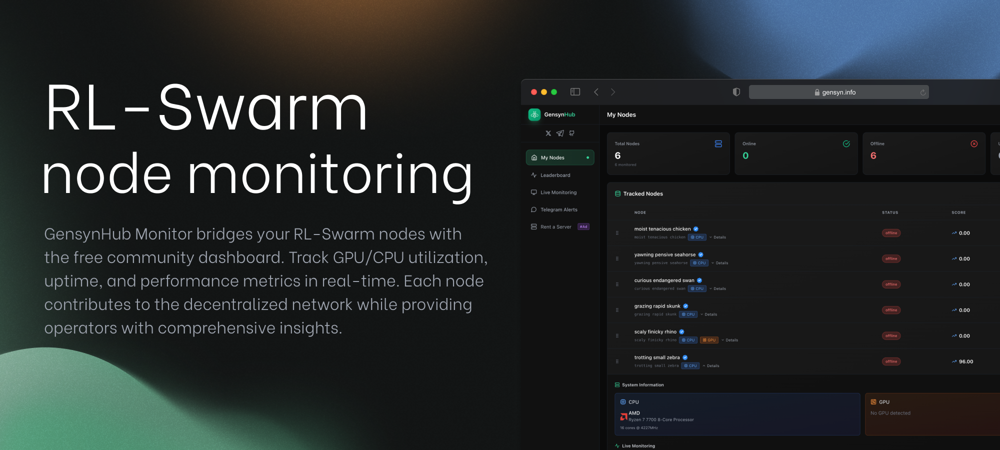

[](https://github.com/KoiIsARobot/GensynHub-Monitor)
[](LICENSE)
[](https://www.gensyn.info/)

# GensynHub Monitor

---



A powerful open-source monitoring tool built specifically to assist with running [Gensyn Swarm nodes](https://github.com/gensyn-ai/rl-swarm). This community-driven add-on seamlessly integrates with the [GensynHub dashboard](https://www.gensyn.info/) to help node operators effectively track their performance.

## 🌟 About GensynHub

**GensynHub is a free community project** designed to support Gensyn node operators. The dashboard at [https://www.gensyn.info/](https://www.gensyn.info/) provides a centralized platform where community members can:

- Monitor multiple nodes in one place
- Track performance metrics and uptime
- View real-time GPU/CPU utilization
- Compare node performance
- Access historical data

This monitor script is the bridge between your [RL-Swarm node](https://github.com/gensyn-ai/rl-swarm) and the GensynHub dashboard, providing the community with powerful tools to optimize their node operations, completely free of charge.

## 🚀 Features

- **Real-time Monitoring**: Live metrics updates every 5 seconds
- **GPU & CPU Support**: Comprehensive detection and monitoring of both GPU and CPU workloads
- **Docker Integration**: Supports both native processes and Docker containers
- **Smart Error Detection**: Automatically detects and reports node errors
- **Cached Location Data**: Efficient location tracking with 30-minute refresh intervals
- **Uptime Tracking**: Accurate uptime percentage calculations
- **Auto-restart**: Daemon mode with automatic restart on failures
- **Single Instance**: Prevents multiple monitors from running simultaneously

## 📋 Requirements

- Linux/macOS system
- [RL-Swarm](https://github.com/gensyn-ai/rl-swarm) installation
- Node.js (will be auto-installed if not present)
- GensynHub account at [https://www.gensyn.info/](https://www.gensyn.info/) (free registration)

## 🛠️ Installation

This monitor is designed as an add-on for your existing RL-Swarm installation.

1. **Navigate to your rl-swarm folder**:
   ```bash
   cd /path/to/rl-swarm
   ```

2. **Download the monitor script**:
   ```bash
   wget https://raw.githubusercontent.com/KoiIsARobot/GensynHub-Monitor/main/gensyn-monitor.sh
   ```

3. **Make the script executable**:
   ```bash
   chmod +x gensyn-monitor.sh
   ```

4. **Run the installer**:
   ```bash
   ./gensyn-monitor.sh
   ```

The installer will:
- Check for Node.js and install it if needed
- Create necessary directories within your rl-swarm folder
- Set up all required scripts
- Guide you through the authentication process

## 🔐 Authentication

After installation, you'll need to authenticate with your GensynHub credentials:

1. **Run the setup script**:
   ```bash
   ./gensyn-hub-monitor/setup.sh
   ```

2. **Enter your credentials**:
   - Email: Your GensynHub email
   - Password: Your GensynHub password

Don't have an account? Register for free at [https://www.gensyn.info/](https://www.gensyn.info/)

## 📖 Usage

### Starting the Monitor

**Background mode (recommended)**:
```bash
./gensyn-hub-monitor/daemon.sh start
```

**Direct mode (for debugging)**:
```bash
node ./gensyn-hub-monitor/gensyn-monitor.js
```

### Managing the Monitor

```bash
# View live logs
./gensyn-hub-monitor/daemon.sh logs

# Stop the monitor
./gensyn-hub-monitor/daemon.sh stop

# Restart the monitor
./gensyn-hub-monitor/daemon.sh restart
```

## 📊 What Gets Monitored?

The monitor tracks all essential metrics from your [RL-Swarm node](https://github.com/gensyn-ai/rl-swarm):

- **System Information**:
  - CPU model, cores, and utilization
  - Memory usage and availability
  - GPU model and VRAM (NVIDIA/AMD)

- **Node Status**:
  - Online/Offline state
  - Uptime percentage

- **Location Data**:
  - IP address and geolocation
  - Cached for efficiency

- **Real-time Metrics**:
  - CPU usage percentage
  - Memory usage percentage
  - GPU utilization (when available)
  - RAM memory usage

All data is displayed on your personal dashboard at [GensynHub](https://www.gensyn.info/).

## 🤝 Contributing

As a community project, we welcome contributions at any stage! Whether it's suggestions, feature requests, bug reports, or code contributions, your input helps make GensynHub better for everyone.

### How to Contribute

1. **Fork the repository**
2. **Create your feature branch** (`git checkout -b feature/AmazingFeature`)
3. **Commit your changes** (`git commit -m 'Add some AmazingFeature'`)
4. **Push to the branch** (`git push origin feature/AmazingFeature`)
5. **Open a Pull Request**

### Areas for Contribution

- Performance optimizations
- New metrics and monitoring features
- Documentation improvements
- Bug fixes and error handling
- Integration suggestions for the dashboard
- Community tools and utilities

## 🐛 Troubleshooting

### Monitor won't start
- Ensure you're in the correct rl-swarm directory
- Check if you've completed authentication: `./gensyn-hub-monitor/setup.sh`
- Verify no other instances are running: `./gensyn-hub-monitor/daemon.sh logs`
- Completely remove `rm ./gensyn-monitor.sh` and `rm -rf gensyn-hub-monitor`, then re-install everything

### Authentication issues
- Verify your GensynHub credentials
- Make sure that your email is verified
- Check your internet connection
- Re-run setup: `./gensyn-hub-monitor/setup.sh`

### Metrics not updating
- Check the logs: `./gensyn-hub-monitor/daemon.sh logs`
- Ensure your RL-Swarm node is running
- Verify network connectivity to GensynHub
- Wait for 30-60 seconds for the dashboard to catch up

## 📝 License

This project is open source and available under the [MIT License](LICENSE).

## 🙏 Acknowledgments

Made with ❤️ by [Koi](https://x.com/rootallowed) for the Gensyn community

Special thanks to:
- The [Gensyn team](https://github.com/gensyn-ai) for creating RL-Swarm
- All community members who contribute to making node operation easier
- Everyone who provides feedback and suggestions

## 🔗 Links

- **GensynHub Monitor**: [https://github.com/KoiIsARobot/GensynHub-Monitor](https://github.com/KoiIsARobot/GensynHub-Monitor)
- **GensynHub Dashboard**: [https://www.gensyn.info/](https://www.gensyn.info/) (Free community project)
- **Gensyn RL-Swarm**: [https://github.com/gensyn-ai/rl-swarm](https://github.com/gensyn-ai/rl-swarm)
- **Issue Tracker**: [GitHub Issues](https://github.com/KoiIsARobot/GensynHub-Monitor/issues)

---

⭐ **Star this project** if you find it helpful!

🤝 **Join the community** and help make Gensyn node operation better for everyone!